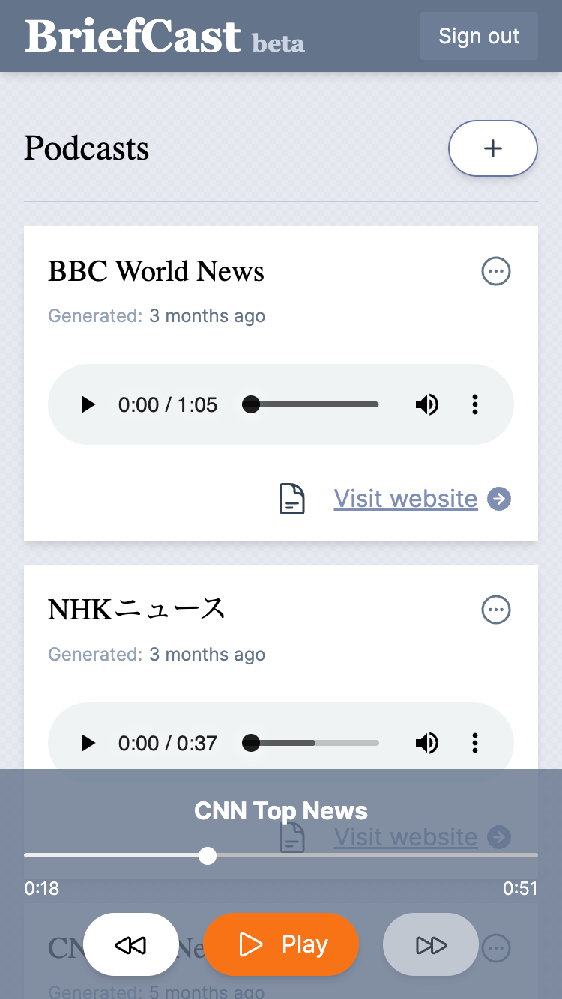

# BriefCast

BriefCast is an AI-powered podcast generator from RSS feeds.



## How It Works

1. You pick a website that offers a RSS feed.
2. BriefCast fetches the feed and coverts it to a short podcast transcript.
3. Finally, the transcript is converted into MP3 audio that you can listen to on any device.

## Technologies Used

### Frontend

- **Svelte** for a reactive UIs.
- **Tailwind CSS** for quick styling
- **Howler.js** for Audio Player

### Backend

- **Deno** for TypeScript built-in API server.
- **Firebase** (Authentication, Firestore) for user management and data storage.
- **OpenAI GPT-3.5** for generating a podcast transcription from the given RSS feed.
- **Google Text-to-Speech API** for converting the transcription into podcast-sounding MP3.

## Getting Started

If you want to run this project on your local machine, follow the steps below.

### Pre-requisites

1. Install Docker, Docker Compose.
1. Install VSCode and VSCode Remote Dev Containers extension (`ms-vscode-remote.remote-containers`).

### Set up the environment variables

1. Create a `.env` file in the project root directory.
1. Add the following environment variables to the `.env` file.

```
GOOGLE_APPLICATION_CREDENTIALS=<path to your GCP service account key file>
OPEN_AI_API_KEY=<your OpenAI API key>
PUBLIC_FIREBASE_API_KEY=<your Firebase API key>
PUBLIC_FIREBASE_AUTH_DOMAIN=<your Firebase auth domain>
PUBLIC_FIREBASE_PROJECT_ID=<your Firebase project ID>
PUBLIC_FIREBASE_STORAGE_BUCKET=<your Firebase storage bucket>
PUBLIC_FIREBASE_MESSAGING_SENDER_ID=<your Firebase messaging sender ID>
PUBLIC_FIREBASE_APP_ID=<your Firebase app ID>
PUBLIC_FIREBASE_MEASUREMENT_ID=<your Firebase measurement ID>
FIREBASE_ADMIN_EMAIL=<your Firebase admin email>
FIREBASE_ADMIN_PASSWD=<your Firebase admin password>
MEDIA_PATH=<path to the directory to store generated MP3>
LOG_PATH=<path to the directory to store logs>
NPM_CACHE=<path to the directory to store NPM cache>
HOST=<your host, not necessary for the dev environment>
```

### Start the development server

1. Clone this repository.
1. Open the `core` directory in VSCode.
1. Select `Remote-Containers: Reopen in Container` 
1. Open terminal in the VSCode and run `./run_dev.sh` to start the API server.
1. Open the project directory in another VSCode window.
1. Select `Remote-Containers: Reopen in Container`
1. Open terminal in the VSCode and run `npm run dev` to start the frontend server.

## What's Changed Recently

### September 2023

- Add player UI.
- Use howler.js as a podcast player engine.

### June 2023

- Delete too old caches periodically.

<Details>
  <Summary>Show old records</Summary>
  
### May 2023

- Add UI to show a transript.

### April 2023

- Add pause after line break in a transcript.
- Add Language selector on the add podcast page.
- Add voice gender selection option.
- Use podcast title in the transcript instead of the feed's title.
- Generate 'all-combined mp3' for 'Play All'.
- Generate a podcast on add.
- Show toast after adding new podcast.
- Skip podcast generation if feed is not changed and MP3 has been created already.
- Added Terms of Use and Privacy Policy.
- Add 'Play All' button.
- Add loading spinners.
- Fix Google Text-to-Speech API fails on a long text.
- Prompt to add a podcast after signing up.
- Add logger.
- Add 'beta' to the title.
- Add Google Analytics.
- Prepare production environment.

### March 2023

- Supported updating user podcasts twice a day.
- Allowed a user to add RSS feeds and listen each feed's podcast from the top page.
- Added sign-in with Google.
- Supported SSL.
- Tuned the default English summarizer to minimize unrelated linking words between topics, referring to this article: https://github.com/openai/openai-cookbook/blob/main/techniques_to_improve_reliability.md
- Inserted 2 second pause between topics so we can tell the beginning of the news more easily.
- Added a Trial feature that supports one-time pod cast generation from any news feed for anyone.
- Implemented automatic CI/CD pipeline with each new code update.
  
</Details>


## TODOs

- Improve overall UI.
- Add sharing my podcast recipe feature.
- Limit trial generation based on the IP address.
- Limit the total number of generations within a day (300 times a day would be the upper limit for my budget).
- Add 'Add Website' button, allowing users to easily add a podcast by specifying a website URL.
- ...

## License

Source code in this repository is licensed under the PolyForm Noncommercial License 1.0.0.
